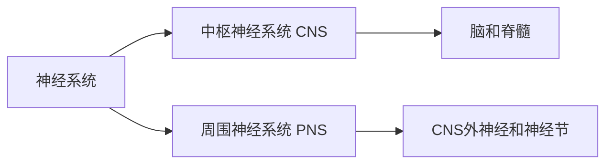
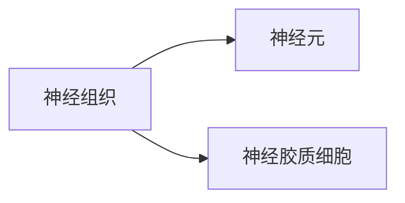

%%
第一部分是神经生物学基本概念的介绍，包括神经系统结构，神经系统基本功能单位，神经系统的信号传递及信息编码，神经元突触结构与功能，受体与信号转导，神经系统的发育与分化。
第二部分介绍感觉系统和运动系统的功能机理，并结合神经系统的具体例子，对神经生物学的研究方法进行介绍。
第三部分介绍脑疾病与生物学调控，主要包括神经损伤与再生，脑疾病干细胞治疗。除了系统的讲课，还将结合文献阅读和讨论，介绍神经科学的一些最新研究成果。
%%

# mind map
## 方法论

#### level

多整体行为水平：
	行为学，躯体感觉，视听觉，痛觉等

分子水平：
	离子通道、受体、酶、遗传物质等

细胞水平：
	神经细胞、生物电活动检测、通路示踪
										![[Pasted image 20250308172553.png]]
#### 形态学方式

大体：解剖、影像[[PET]]等

组织：
1. 苏木素-伊红 **[[HE染色]]**
	苏木精碱性：细胞核和胞质$\to$紫蓝色
	伊红酸性：细胞质和细胞外基质$\to$红色
2. 锇酸染色
	髓鞘(主要成分：脂质)$\to$黑色
	神经纤维受损时，如多发性硬化症，脑脊髓炎等疾病均可导致髓鞘的变形，崩解或脱失
3. 氯化金和[[AchE染色]]
	神经、运动终版$\to$黑色/棕黑色
4. Cajal银浸染色（old）
5. 尼氏染色
	碱性染料：尼氏体嗜碱$\to$着色
	%%i.e. HE%%
6. [[束路追踪]]
7. 免疫组化
	根据二抗标记的不同（荧光素、酶、铁蛋白、胶体金或银标记）放大
8. 原位杂交

#### 生物学方法

1. 神经行为学：比较动物行为
	- 动物自主活动标志**中枢神经系统的兴奋状态**
	- 学习记忆
2. 电生理学：研究生物细胞/组织的电学特性
	- [[膜片钳]]

## 1. 神经系统基本结构与功能

###### [[brain]]

- **大脑解剖结构**
    - 脊髓、延髓、脑桥、中脑、小脑
    - 间脑(丘脑、下丘脑、垂体、松果体)
    - 大脑半球(大脑皮层、基底神经节、海马、杏仁核)
- **大脑皮层分区**
    - 额叶(运动、语言、智能、情感)
    - 顶叶(感觉、阅读)
    - 颞叶(听觉、空间位置)
    - 枕叶(视觉、阅读)
###### 脊椎动物的神经系统基本结构

[[中枢神经系统 CNS]] 、[[周围神经系统 PNS]]

## 2. 神经元与神经胶质细胞

- **[[神经元 Nerve cell]]**
    - 胞体、树突、轴突、轴丘
- **神经元分类**
    - 功能分类(感觉、运动、中间神经元)
    - 形态分类(多极、单极、假单极、双极)
    - 其他分类方式(树突特征、轴突长度、递质类型)
- **[[神经胶质细胞 Glia]]（其数量为神经元的 10-50 倍）**
    - 中枢神经胶质(星形胶质、少突胶质、小胶质)
    - 周围神经胶质(施万细胞)
    - 功能(支持、绝缘、保护、营养、免疫等)

## 2.5 [[神经元膜物质转运]]

- **被动转运**
    - 简单扩散(脂溶性分子、小分子气体)
    - 易化扩散(特定离子通道、载体蛋白)
- **主动转运**
    - 原发性主动转运(Na⁺-K⁺ ATP酶/钠钾泵)
    - 次级主动转运(协同转运、反向转运)
- **囊泡运输**
    - 胞吞作用(受体介导的胞吞、液相胞吞)
    - 胞吐作用(递质释放、膜蛋白插入)
    - 轴浆运输(顺行与逆行轴浆运输)
- **物质转运与神经功能**
    - 离子泵与静息电位维持
    - 神经递质的重摄取
    - 营养物质与信号分子转运
    - 膜蛋白受体与离子通道的更新

## 3. [[电生理基础]]

- **[[静息电位 RP]]**
    - 离子机制(胞内外离子浓度差、通透性差异、钠泵)
    - 影响因素
- 离子通道类型与功能
	- [[电压门控离子通道]](Na⁺、K⁺、Ca²⁺通道)
	- [[化学门控离子通道]](离子通道型受体)
	- [[机械门控离子通道]]
	- 通道特性(选择性、通量、闸门控制)
		通过离子通道的离子跨膜运动速度 >> 载体转运的速度
		离子通道仅有相对的选择性，而载体则具有严格的选择性
		
		孔道大小、离子形成氢键的能力及与孔道内位点相互作用的强度等
	- [[离子通道病 (channelopathies)]]
- **[[动作电位 AP]]**
    - 特征( all-or-none principle、不衰减传播、脉冲式发放)
    - 阈电位与产生机制
    - 传导方式(有髓与无髓神经纤维)
- **[[局部电位 LP]]**
    - 概念与类型(EPSP、IPSP等)
- **神经元兴奋性**
    - 影响因素(静息电位、阈电位、离子通道、不应期)

## 4. 神经信号传递

- **神经电信号传递方式**
    - 突触传递与非突触传递
    - 化学突触与电突触
    - 兴奋性与抑制性传递
- **[[突触 synapse]]**
    - 化学突触(突触前膜、突触间隙、突触后膜)
    - 电突触(缝隙连接)
- **突触传递机制**
    - 化学突触传递(电-化学-电转换)
    - 神经递质释放(SNARE假说、Ca2+依赖)
    - 突触后电位整合
- **[[神经递质]]**
    - 种类(胆碱类、单胺类、氨基酸类、多肽类等)
    - 清除方式(酶分解、重摄取、扩散)

## 5. 受体与信号转导

- **受体特性与分类**
    - 特异性、饱和性、可逆性
    - [[离子通道型受体]]、[[G蛋白耦联]]、酶相关[[酶偶联受体]]、[[转录调节因子受体]]
- **信号传递通路**
    - 离子通道型受体(阳离子与阴离子通道)
    - Ca2+调控的神经递质释放
	- **信号放大机制（级联放大）**
		- G 蛋白耦聯受體（GPCR）通過第二信使（如 cAMP、IP3）引發的放大效應
		- Ca²⁺ 依賴的 SNARE 假說與突觸小泡釋放
		- 細胞內酶促放大（蛋白激酶、磷酸化級聯）
	- 神经元信号传递步骤   ms 毫秒级！！
		 神经冲动→突触小体→突触前膜去极化→Ca2+通道开放→Ca2+内流→突触小泡与前膜融合→递质释放→与突触后膜受体结合→突触后膜离子通道通透性改变→
		 突触后神经元膜电位改变（突触后电位，EPSP（兴奋性突触后电位）或IPSP（抑制性突触后电位） ）![[Pasted image 20250321221942.png]]
- **特定受体系统**
    - GABA受体与药物开发
    - 多巴胺系统(帕金森病相关)

## 6. 感觉系统

- **视觉系统**
    - 视网膜结构("外周脑")
    - 感光细胞(视杆与视锥细胞)
    - 视觉感受野
    - 视觉信息处理(视网膜拓扑与皮层柱)
    - 平行与串行信息处理

## 7. 运动系统

- **运动控制神经结构**
    - 大脑皮层运动区
    - 脑干
    - 脊髓(α运动神经元-"最后公路")
- **反射**
    - 膝跳反射机制
    - 神经肌肉接头
- **运动单位**
    - 概念与神经支配率
- **感受器**
    - 肌梭(结构与功能)
    - 腱器官(结构与功能)
    - γ运动神经元作用

## 8. [[神经系统发育]]

- **神经管形成**
    - 形态学变化(三脑泡到五脑泡)
    - 形成过程(神经板→神经沟→[[神经管]])　
- **轴向形成**
    - 头尾轴与背腹轴的分子机制
    - 信号分子对细胞分化的影响
- **神经细胞迁移**
    - "inside-out"原则
- **生长锥**
    - 结构与功能(轴突引导)

## 9. 神经损伤与再生

- **神经损伤过程**
    - 轴突断裂与影响
- **损伤类型**
    - 逆向变性、跨神经元变性/萎缩
    - Seddon和Sunderland分类系统
- **神经再生**
    - 外周与中枢神经再生差异
    - 促进中枢神经再生策略

## 10. [[神经系统疾病]]与神经干细胞

- **主要神经疾病**
    - 阿尔茨海默病(淀粉样斑块假说)
    - 帕金森病(多巴胺缺乏)
    - 肌萎缩侧索硬化症(ALS)(TDP-43机制)
- **治疗策略**
    - 干细胞治疗(细胞替代、环境支持)
    - 左旋多巴治疗(帕金森)
- **神经干细胞**
    - 特点(自我更新、多向分化)
    - 应用潜力